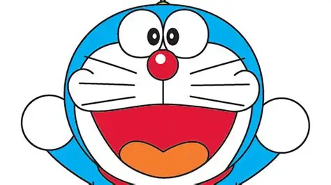
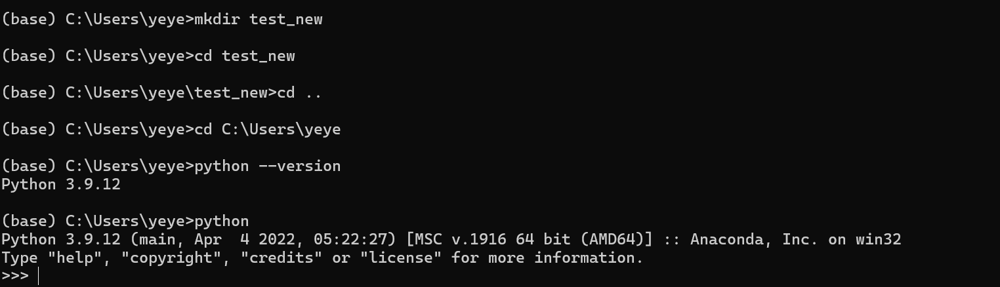
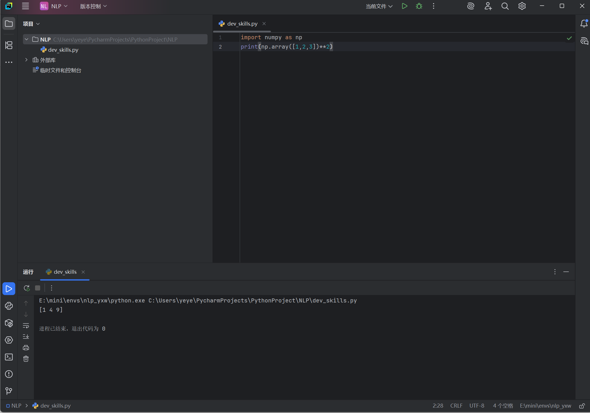

# 哆啦A梦的自我介绍



大家好，我是**哆啦A梦**，我的身份是*来自22世纪的猫型育儿机器人*。以下是我的自我介绍：

---

## 基础档案
### 外貌特征
- 蓝色圆胖身体，白色肚皮
- 红色鼻子与铃铛项圈
- 四次元口袋藏在肚子上

## 我的好朋友
1.  野比大雄
2.  源静香
3.  刚田武

### 重要坐标
住址：[野比家（东京都练马区月见台）](https://baike.baidu.com/item/%E9%87%8E%E6%AF%94%E5%AE%B6/10573176)

### 日常作息表
| 时间 | 日常安排 |
| ---- | -------- |
| 早上 | 帮大雄解决麻烦 |
| 中午 | 吃铜锣烧 |
| 晚上 | 整理四次元口袋 |

### 人生信条
> 只要有梦想，就一定能实现！

---

## 我的专业是人工智能


## 我可以在IDE上使用我建立的虚拟环境




## 我最喜欢的环境管理工具是conda



## 我最喜欢的一段代码
```python
# dev_skills_env.py
# 我的第一个AI环境测试代码
def hello_ai():
    print("人工智能环境搭建成功！")
    print("欢迎进入 AI 学习世界～")

hello_ai()


